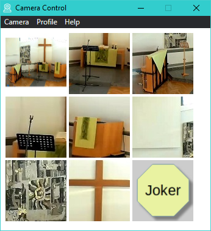
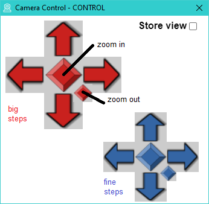

# Camera Control
Camera Control is a software "remote control" for conference cameras, e.g. Tenveo NV10U.  

Smart access to stored positions and zoom settings:  

Setup of settings:  

Detailed user description is available in [help](ui/help.html) / <a href="ui/help.html" target="_blank">help (browser)</a>.  
There you will also find notes to requirements and installation.
  
# Background
This software was written because the hardware remote control provided with our  camera was not feasable during online services in our church (EMK). 
The presenter has to optimize audio and control songs in parallel to the online service. Therefore a smart solution was required for controlling the camera.

With this software a simple solution is provided without overstress the presenter. Therefore only important views and settings are available.

# Building
The software is written in the programming languange "Go".
A "Go" installation is required, <a href="https://go.dev/" target="_blank">Official Go Webpage</a>.

"Go" supports many operating systems.
Therefore a portable UI was used: <a href="https://github.com/asticode/go-astilectron" target="_blank">"Astilectron UI"</a>.

Currently only Windows was tested but the application should be portable to other operating systems as well.

You need to install the tool for building the application bundle 
<a href="https://github.com/asticode/go-astilectron-bundler" target="_blank">"Astilectron-Bundler"</a>.   
The application is built by calling "astilectron-bundler.exe" in the camera_control base directory.
Afterwards you have to deliver the result "Camera Control.exe" with the "ui" and the "licenses" folder.

# Windows Binary for Download
There is a binary for download available in menu "Actions": select a workflow run. 
In the section "Artifacts" download the zip archive: Camera-Control-windows-amd64.zip.

# USB Protocol
The software uses Pelco-D protocol to access the camera.
If your camera supports other protocols or commands they can be extended (see folder "camera"). The "Camera" interface just needs to be implemented for new protocols. The source file TenveoNV10U.go can be used as example.
There is an unmaintained example of a Visca protocol, too.

Unfortunately the Tenveo camera has some protocol and firmware issues. Therefore focus and other features as powering on/off are not working.
The Pelco-D protocol was supported better than other protocols, therefore it was used as base.

Info: The support of Tenveo answered but was not able to support a fix or even deliver a better documentation for the camera.

# "ui" folder
The "ui" folder is located outside of the application bundle to easily change pictures and extend profiles.

# Improvements and Donation
You are welcome to improve and extend the application as well as suggest improvements.
A donation is appreciated, too. See the "about" dialog in the software.
